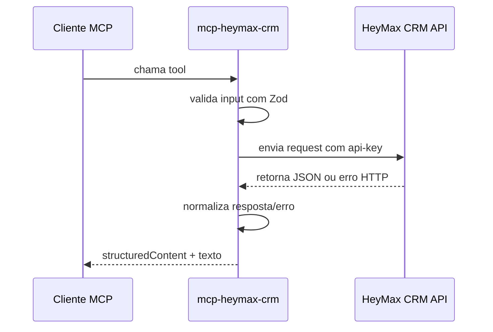

# mcp-heymax-crm

[](https://github.com/kemosoft-team/mcp-heymax-crm/actions/workflows/ci.yml)

MCP server em TypeScript para a API de atendimento do HeyMax CRM hospedada em `ms-crm-az.kemosoft.com.br`.

## Estado atual

Esta primeira versão expõe apenas ferramentas read-only. Foi uma decisão deliberada.

Revisão adversarial:
- A OpenAPI da API está incompleta para operações de escrita.
- Publicar tools destrutivas agora aumentaria risco operacional sem garantia de contrato estável.
- O servidor já é útil para consulta, mas ainda não é um conector "completo" de CRM.

## Fluxo



## Para quem isso é utilizável

Hoje o servidor é utilizável por qualquer pessoa que tenha:

- Node.js `>= 22`
- acesso a um cliente MCP compatível com `stdio`
- uma credencial válida em `KEMOSOFT_API_KEY`

Revisão adversarial:
- Sem credencial válida, o pacote instala mas não entrega valor real.
- Portanto o produto ainda não é "aberto para qualquer pessoa" no sentido de acesso irrestrito à API.

## Requisitos

- Node.js `>= 22`
- `npm`
- Credencial válida em `KEMOSOFT_API_KEY`

## Variáveis de ambiente

Copie `.env.example` para `.env` ou exporte as variáveis no shell:

- `KEMOSOFT_API_KEY`: obrigatório
- `KEMOSOFT_API_BASE_URL`: opcional, default `https://ms-crm-az.kemosoft.com.br`
- `KEMOSOFT_TIMEOUT_MS`: opcional, default `20000`
- `KEMOSOFT_API_SOURCE`: opcional nesta versão; será usado nas futuras operações de escrita

## Instalação

Via npm local:

```bash
npm install
npm run build
```

Via `npx` depois da publicação no npm. O nome `mcp-heymax-crm` está livre no registry no momento desta revisão:

```bash
npx mcp-heymax-crm
```

## Execução

Modo local via stdio:

```bash
npm start
```

Desenvolvimento:

```bash
npm run dev
```

## Publicação no npm

O pacote já está preparado para distribuição CLI:

- `bin` configurado para `mcp-heymax-crm`
- `prepack` executa `build` e `smoke`
- `LICENSE` incluída
- CI básica configurada no GitHub Actions
- `publishConfig.access=public` definido

Antes de publicar:

```bash
npm login
npm run prepack
npm publish --access public
```

## Tools disponíveis

- `kemosoft_list_active_pipelines`
- `kemosoft_list_lost_reasons`
- `kemosoft_list_events`
- `kemosoft_list_tags`
- `kemosoft_validate_phone`
- `kemosoft_search_address_by_cep`
- `kemosoft_find_services_by_phone`
- `kemosoft_get_pipeline_flow`
- `kemosoft_get_service_status_by_id`
- `kemosoft_get_service_status_by_funnel_and_cpf`

## Exemplo de configuração em cliente MCP

Exemplo genérico de comando:

```json
{
  "command": "node",
  "args": ["C:/caminho/para/mcp-heymax-crm/dist/index.js"],
  "env": {
    "KEMOSOFT_API_KEY": "sua-chave",
    "KEMOSOFT_TIMEOUT_MS": "20000"
  }
}
```

### Claude Desktop

```json
{
  "mcpServers": {
    "heymax-crm": {
      "command": "npx",
      "args": ["-y", "mcp-heymax-crm"],
      "env": {
        "KEMOSOFT_API_KEY": "sua-chave",
        "KEMOSOFT_TIMEOUT_MS": "20000"
      }
    }
  }
}
```

### Codex

```json
{
  "mcpServers": {
    "heymax-crm": {
      "command": "npx",
      "args": ["-y", "mcp-heymax-crm"],
      "env": {
        "KEMOSOFT_API_KEY": "sua-chave"
      }
    }
  }
}
```

### Cursor

```json
{
  "mcpServers": {
    "heymax-crm": {
      "command": "node",
      "args": ["/caminho/para/mcp-heymax-crm/dist/index.js"],
      "env": {
        "KEMOSOFT_API_KEY": "sua-chave"
      }
    }
  }
}
```

## Estrutura do projeto

```text
src/
  api-client.ts
  config.ts
  constants.ts
  format.ts
  index.ts
  schemas.ts
  tools.ts
  types.ts
```

## Verificação

```bash
npm run build
npm run typecheck
npm run smoke
```

## Limitações atuais

- Sem tools de escrita
- Sem transporte HTTP
- Sem paginação real no backend; o limite atual corta o array retornado pela API
- Alguns endpoints da API não possuem schema de resposta confiável na documentação
- A utilidade prática ainda depende de distribuição controlada de `KEMOSOFT_API_KEY`
